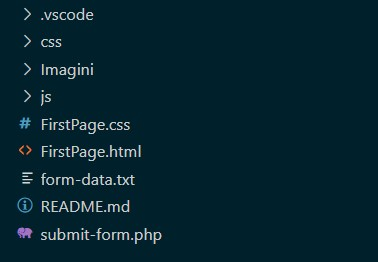
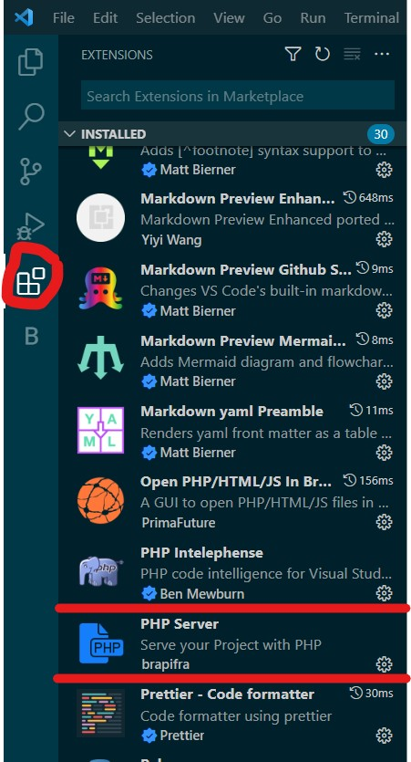
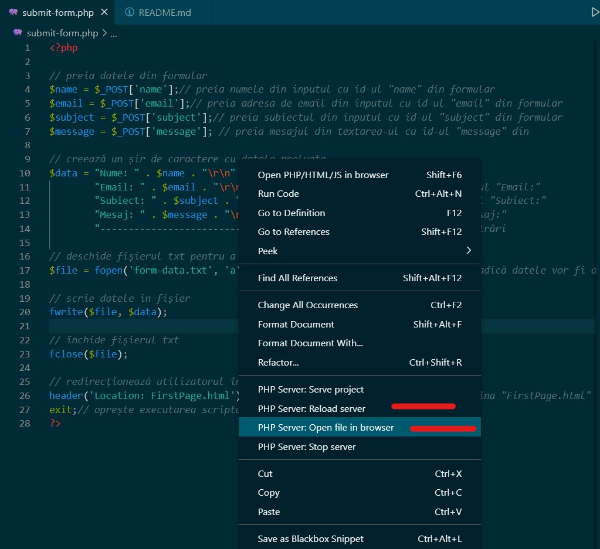

## Single page layout 
##### Un site web care prezintă date despre un eveniment fictiv (Stand-Up Comedy Festival)

### Tehnologii Folosite
* HTML
* CSS
* JavaScript
* PHP

### Descriere
În cadrul acestui site web, utilizatorii pot vedea informații legate de un eveniment ce urmează să aibă loc. De asemenea, aceștia se pot înscrie la atelierele ce vor avea loc, completând formularul pus la dispoziție.

### Structura proiectului(Structura fișierelor)
În folder sursă regăsim următoarele: 

* Un folder css și un folder js. Pentru asta am instalat Bootstrap, iar din folderul principal le-am luat cu copy-paste pe cele două. Linku-ul cu site-ul de unde poate fi descărcat Bootstrap:
https://getbootstrap.com/docs/5.0/getting-started/download/
* Un fișier HTML unde se regăsește codul principal pentru pagina web
* Un fișier CSS prin intermediul căruia am îmbunătățit aspectul paginii web
* Un fișier JavaScript unde e adăugată funcționalitatea secțiuni Head(parallax)
* Un fișier PHP unde este adăugată funcționalitatea formularului din secțiunea Contact
* Fișierul form-data.txt unde se salvează datele trimise prin intermediul formularului
* Un folder Imagini în care se regăsesc imaginile folosite în cadrul proiectului 

### Cerințe de configurare/instalare
* Descărcați proiectul 
* Dezarhivați proiectul
* Deschideți folderul și dați dublu click pe FirstPage.html
##### Rularea proiectului într-un mediu de dezvoltare(Visul Studio Code)
* Asigurați-vă că aveți mediul de dezvoltare instalat
* Descărcați proiectul
* Dezarhivați proiectul
* Deschideți Visual Studio Code(File - Open Folder - Folderul dezarhivat)
* Instalați următoarele extensii

* Mergeți în submit-form.php, dați click stânga(Open file in browser).
În cazul în care pagina nu se încarcă, dați din nou click stânga(Reload server)

Totul ar trebui să funcționeze în acest moment!

### Probleme care pot aparea
Este posibil ca efectul parallax să nu ruleze în browser.

